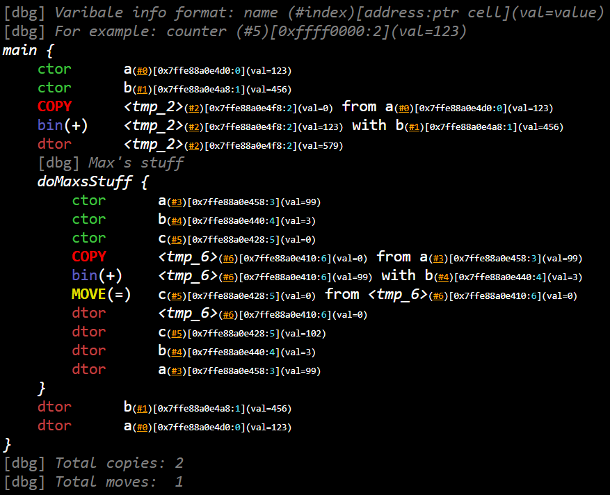
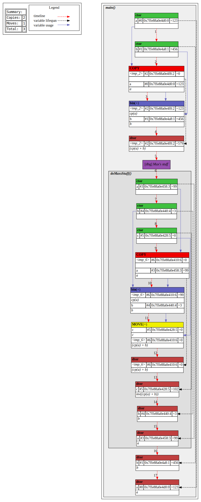

# TracerGCC
This project implements the infrastructure to trace most of the basic operations on specific variables.
Its primary purpose is to help understand the intrinsic workings of compilers in terms of optimizations, as well as profile your code on a relatively high level.

## Installation
This project can be built via CMake:
```bash
mkdir build
cd build
cmake ..
make
```
Please note that the binary relies upon residing in and being started
from the `build` subdirectory.

## Usage
To use the features of this project, include `tracer.h` and `trace.h`.
To trace operations over specific variables, declare them either via
the `DECL_TVAR(T, NAME, [VALUE])` macro, or just by creating a
`Tracer<T>` instance. (Note that the first approach also remembers the 
variable's name). To add function (scope) information, use the `FUNC_GUARD` macro, or just instantiate a `TraceFuncGuard` inside the
scope.

Some control over the tracer's implementation is provided via several preprocessor macros:
 - `TRACER_COPY_IN_ARGS` switches between two alternative implementations for operators
   that have to produce a new `Tracer` instance as a result;
 - `TRACER_RVALUE_REFS` enables move-contructors for `Tracer`s.

The results are being accumulated in the global `Trace` instance, available via `Trace::getInstance()`. To represent them nicely, you may use on of the visualizers in `./visualizers` - currently, dot (GraphViz) and HTML are available. You may see examples of their usage and results below.

## Examples
### Sample 1
The following code showcases some of the basic features of this library in a relatively simple fashion. (The full code can be found in [main_simple.cpp](./examples/main_simple.cpp) - to use it, replace `main.cpp` with it).
``` c++
// Inside main
{
    FUNC_GUARD;

    DECL_TVAR(num_t, a, 123);
    DECL_TVAR(num_t, b, 456);

    printf("a + b = %d\n", (int)(a + b));

    Trace::getInstance().addDbgMsg("Max's stuff");
    doMaxsStuff();
}
```
``` c++
// A separate function for extra testing
static void doMaxsStuff() {
    FUNC_GUARD;

    DECL_TVAR(int, a, 99);
    DECL_TVAR(int, b, 3);
    DECL_TVAR(int, c, 0);

    c = a + b;
}
```
``` c++
// Producing output after finishing collecting data
HtmlTraceVisualizer{std::fs::path{"./output/log.html")}
    .visualize(Trace::getInstance());

DotTraceVisualizer{std::fs::path{"./output/log.svg")}
    .visualize(Trace::getInstance());
```
This produces the following results:
1. Html: ([link](./examples/log_simple.html)).



You should download it and check it out locally, as GitHub doesn't allow embedding such elaborate html. It has nice fetures like autoscrolling and highlighting.

2. Dot:



### Sample 2
And here's a larger sample. This one showcases bubble sort as an example. Since its files are quite a lot larger, they aren't included into this preview, so feel free to play around with the files directly: [main_bubble.cpp](./examples/main_bubble.cpp), [log_bubble.html](./examples/log_bubble.html), [log_bubble.svg](./examples/log_bubble.svg).

## Copyright and License
Copyright © 2022 Andrew Belyaev. All rights reserved.

See the [LICENSE](/LICENSE) for terms & conditions for usage of this software and a
DISCLAIMER OF ALL WARRANTIES.
